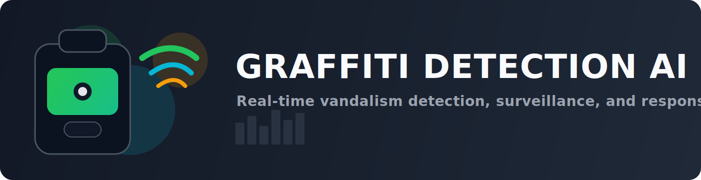

# Graffiti Detection AI Model

<p align="center">
  
</p>

AI-powered graffiti detection built on YOLOv8 for training, inference, surveillance, alerting, and API integration.

## Why I Built This

I built this library because I hate seeing my city being destroyed and ruined by graffiti. The goal is to detect incidents early so response teams can act faster.

## What This Project Does

- Trains YOLOv8 models on graffiti datasets (YOLO annotation format)
- Runs inference on single images, folders, videos, and webcam streams
- Monitors multiple cameras in real time and triggers alert channels
- Exposes a FastAPI service for integration with existing systems
- Logs incidents to SQLite/JSON and supports daily reporting

## What Makes It Stand Out

- End-to-end pipeline in one repo: data prep -> training -> inference -> surveillance -> API -> incident tracking
- Production-oriented scripts (not notebook-only)
- Alert channel support: email, SMS, webhook, Discord, Slack
- Test coverage across data, metrics, alerts, visualization, incident logging, and integration

## Requirements

- Python 3.8+
- CUDA-capable GPU (recommended for training / real-time workloads)
- Dataset in YOLO format (`class x_center y_center width height`)

## Installation

```bash
git clone https://github.com/<your-username>/graffiti-detection-ai-model.git
cd graffiti-detection-ai-model
python -m venv venv
source venv/bin/activate  # Windows: venv\Scripts\activate
pip install -r requirements.txt
```

Install directly from pip (after the first PyPI release):

```bash
pip install graffiti-detection-ai-model
```

Quick import example:

```python
from src.evaluation.metrics import calculate_iou
```

## Quick Start

### 1. Prepare dataset

```bash
python scripts/prepare_dataset.py --data-dir data/raw --output-dir data --validate --copy
```

### 2. Train model

```bash
python scripts/train.py --data configs/dataset.yaml --model yolov8n --epochs 100
```

### 3. Run inference

```bash
python scripts/inference.py --model models/best.pt --source image.jpg
python scripts/inference.py --model models/best.pt --source 0 --show
```

### 4. Evaluate

```bash
python scripts/evaluate.py --model models/best.pt --data configs/dataset.yaml --split test
```

## Real-Time Surveillance and Alerts

Use the example configs as a base:

```bash
cp configs/cameras_example.json configs/cameras.json
cp configs/alerts_example.json configs/alerts.json
```

Run multi-camera monitoring:

```bash
python scripts/multi_camera_surveillance.py \
  --model models/best.pt \
  --cameras configs/cameras.json \
  --alert-config configs/alerts.json
```

Optional utilities:

```bash
python scripts/real_time_dashboard.py --stats-file outputs/stats.json
python scripts/incident_logger.py --action stats --period today
```

## API

Start API service:

```bash
uvicorn api.graffiti_detector:app --host 0.0.0.0 --port 8000
```

Main endpoints:

- `GET /`
- `POST /detect`
- `POST /detect/annotated`
- `POST /detect/batch`
- `GET /stats`

## Testing

```bash
python tests/run_tests.py
# or
pytest tests/
```

## Deployment

For Docker/Compose/Kubernetes/edge/cloud setup, see [DEPLOYMENT.md](DEPLOYMENT.md).

## Project Structure

```text
api/        FastAPI service
configs/    Dataset, training, cameras, alerts configs
scripts/    Training, inference, evaluation, surveillance, dashboard tools
src/        Core data/evaluation/util modules
tests/      Unit and integration tests
```

## Author

<div align="center">

[](https://pierrehenry.dev)

**Pierre-Henry Soria**

Passionate software AI engineer building intelligent systems to solve real-world problems.

☕️ Enjoying this project? [Buy me a coffee](https://ko-fi.com/phenry) to support more AI innovations!


[](https://bsky.app/profile/pierrehenry.dev)
[")](https://x.com/phenrysay)
[](https://github.com/pH-7)

</div>

## License

This project is distributed under the [MIT License](LICENSE.md).

## Disclaimer

This model is intended to assist maintenance and urban management teams. Always comply with local privacy and surveillance regulations when deploying computer vision systems.
